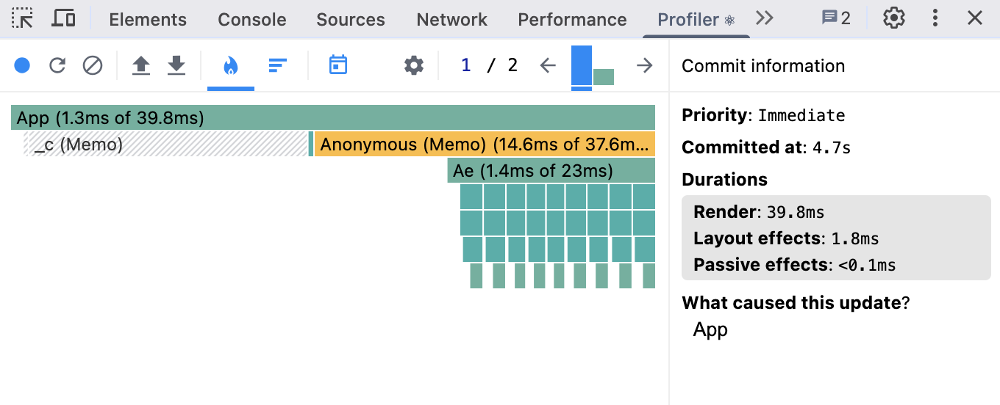
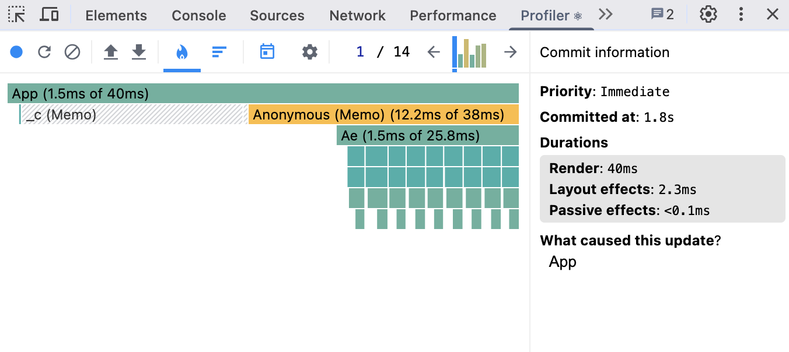
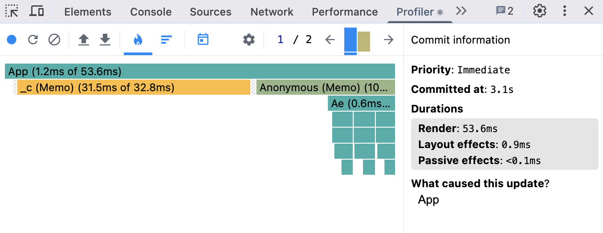
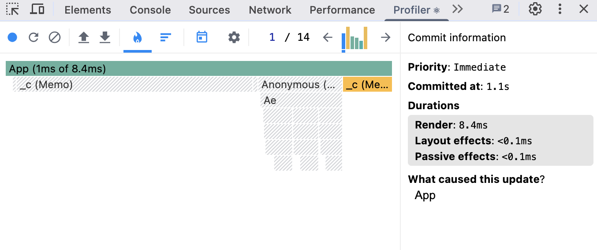

# Performance Optimization Report

## Baseline Measurements

### Interaction A: Sort countries

- **Commit duration**: <0.1 ms
- **Render duration**: 540.4 ms
- **Screenshot**: 

### Interaction B: Search countries

- **Commit duration**: <0.1 ms
- **Render duration**: 240.7 ms
- **Screenshot**: 

### Interaction C: Change year

- **Commit duration**: <0.1 ms
- **Render duration**: 527.3 ms
- **Screenshot**: 

### Interaction D: Toggle column

- **Commit duration**: <0.1 ms
- **Render duration**: 506.6 ms
- **Screenshot**: 

## Optimized Measurements

### Interaction A: Sort countries

- **Commit duration**: 1.8 ms
- **Render duration**: 39.8 ms
- **Screenshot**: 

### Interaction B: Search countries

- **Commit duration**: 2.3 ms
- **Render duration**: 40 ms
- **Screenshot**: 

### Interaction C: Change year

- **Commit duration**: 0.9 ms
- **Render duration**: 53.6 ms
- **Screenshot**: 

### Interaction D: Toggle column

- **Commit duration**: <0.1 ms
- **Render duration**: 8.4 ms
- **Screenshot**: 

## Summary of Improvements

| Interaction      | Baseline (ms) | Optimized (ms) | Improvement |
| ---------------- | ------------- | -------------- | ----------- |
| Sort countries   | 540.4         | 39.8           | 92.64%      |
| Search countries | 240.7         | 40             | 83.38%      |
| Change year      | 527.3         | 53.6           | 89.84%      |
| Toggle column    | 506.6         | 8.4            | 98.34%      |
| **Average**      | **453.75**    | **35.45**      | **92.19%**  |
